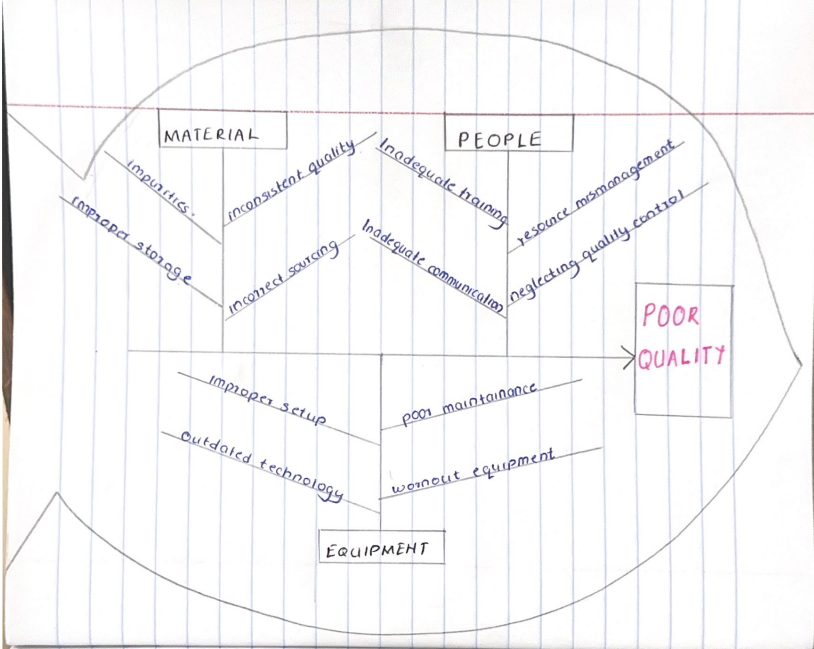

# BBT3104: Advanced Database Sytems Semester Project

| **Key**                                                               | Value                                                                                                                                                                              |
|---------------|---------------------------------------------------------|
| **Name of Business Chosen for the Case Study**                                                       | UNGA GROUP LIMITED |
| **Industry**                                                       | FOOD PROCESSING INDUSTRY |
| **Group Name**                                                               | A6 |
| **Semester Duration**                                                 | 19th August - 25th November 2024                                                                                                                       |

# Cause-and-Effect Diagram

# Enhanced Entity Relationship Diagram (EERD)

# Database Schema

# System Architecture
